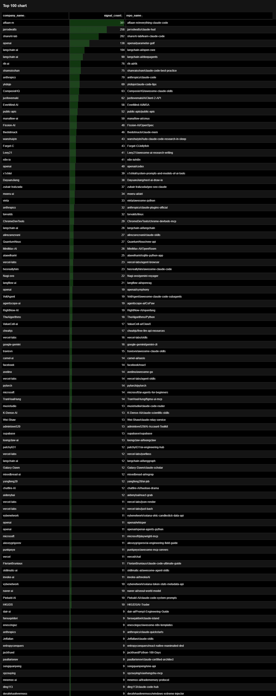

# GTM Intelligence Engine: High-Growth Signal Pipeline

Building GTM pipeline using GCP buckets, Bruin and Bigquery for production-grade Data Engineering. Everything-as-a-code.

## The Problem: The "Signal-to-Noise" Gap
In modern Go-To-Market (GTM) operations, sales teams are drowning in lead lists that are "stale" or "generic." Standard databases (Apollo/ZoomInfo) often lag behind real-world growth events.

**This project solves the "Integration Wall"** by building a production-grade Data Engineering foundation that identifies **High-Growth Intent signals** (e.g., specific tech adoption or hiring surges) directly from raw datasets, preparing them for autonomous AI Agents.

---

## The "Relational Grounding" Advantage
Unlike basic AI outreach tools that rely on generic company names, this engine uses a **Structured Intent CSV** as its source of truth  (here a real March 2026 Builtin jobs dataset `structured_jobs.csv` is used as a Source of Truth for keyword extraction and "Relational Grounding").

### Why this matters for GTM:
* **Tech-Stack Alignment:** We don't just find "OpenAI"; we find "OpenAI's interest in distributed systems" by matching their hiring requirements with their actual engineering activity.
* **Composite Scoring:** The engine calculates a "High-Growth Score" by joining distinct signals (Direct vs Implicit).
* **Precision Filtering:** By using the CSV as a lookup table, we reduce "API Noise" and ensure that enrichment credits are only spent on accounts with a proven hiring budget.

---

## 🛠 The 2026 Tech Stack (Everything-as-Code)
* **Infrastructure:** [Terraform](https://www.terraform.io/) (GCP) - Manages BigQuery & GCS.
* **Orchestration & Transformation:** [Bruin](https://getbruin.com/) - A single-binary tool for ingestion and SQL/Python transformations.
* **Data Warehouse:** Google BigQuery (Partitioned by date, Clustered by Company).
* **Visualization:** [Apache Superset](https://superset.apache.org/) (Preset) - Semantic-layer based dashboards.

---

## Data Architecture
1.  **Ingestion (Datalake):** Raw data (GitHub Archive) is pulled via Bruin Python tasks and stored as Parquet in **GCS**.
2.  **Warehouse (DWH):** Data is registered as **BigQuery** external tables.
3.  **Transformation:** Bruin SQL tasks calculate growth metrics and extract company names.
4.  **Semantic Layer:** Data is exposed to Superset for visualization.

---

## Cost-Aware Engineering (Free Tier Strategy)
This project is architected to run **entirely within the Google Cloud "Always Free" tier**. 

### The Data Flow & Costs:
1.  **Ingestion:** Queries GitHub Archive Public Dataset (Free Tier: First 1TB/month).
2.  **Raw Storage:** Parquet files in GCS (Free Tier: Up to 5GB in `us-central1`).
3.  **Analytics:** BigQuery tables (Free Tier: First 10GB storage, 1TB query processing).

### Technical Constraints & "Gotchas"
* **GCP Region:** Use `us-central1` for Free Tier eligibility.
* **BigQuery Sandbox:** Tables may have a 60-day expiration; re-run the idempotent pipeline to recreate.
* **Data Lake Lifecycle:** 30-day auto-delete rule in Terraform prevents storage overages.

---

## Data Engineering Zoomcamp 2026 Requirements

This project is explicitly designed to exceed the Capstone evaluation criteria. Below is the technical breakdown of how we meet each requirement:

### 📐 Project Architecture
```text
┌────────────────┐      ┌──────────────────┐      ┌──────────────────┐      ┌──────────────────┐
│  Data Source   │      │ Orchestration    │      │    Data Lake     │      │  Data Warehouse  │
│(GitHub Archive)│      │   (Bruin CLI)    │      │    (Google CS)   │      │ (Google BigQuery)│
└──────┬─────────┘      └────────┬─────────┘      └────────┬─────────┘      └────────┬─────────┘
       │                         │                         │                         │
       │  1. Extract (Python)    │                         │                         │
       └────────────────────────>│  2. Load (Parquet)      │                         │
                                 ├────────────────────────>│                         │
                                 │                         │  3. Register Ext Table  │
                                 │<────────────────────────┼────────────────────────>│
                                 │                         │                         │
                                 │  4. Transform (SQL)     │                         │
                                 ├─────────────────────────┴────────────────────────>│
                                 │                                                   │
                                 │           5. Visualize (Preset.io)                │
                                 └──────────────────────────────────────────────────>│
                                                                                     ▼
                                                                            [Public Dashboard]
```

### 📋 Detailed Criteria Fulfillment
*   **Problem Description**: Defined in the first section. We solve the "Integration Wall" for GTM by grounding AI agents in live engineering activity.
*   **Cloud & IaC**: 
    *   **Cloud**: All data processing (Storage, DWH) happens in Google Cloud Platform. 
    *   **IaC**: The environment is 100% reproducible via **Terraform** (see `/terraform` folder).
*   **Data Ingestion (Batch)**: 
    *   **Flow**: `GitHub Archive API` -> `Python (Polars/Pandas)` -> `GCS (Standard)`.
    *   **Automation**: Bruin handles retries, dependency checks, and parameterization (e.g., `--start-date`).
*   **Data Warehouse**: 
    *   **Storage**: Data is stored as Hive-partitioned Parquet on GCS and exposed via **BigQuery External Tables**.
    *   **Optimization**: The final `fct_growth_signals` table is **Partitioned** by `signal_date` and **Clustered** by `company_name` to minimize scan volume and cost.
*   **Transformations**: 
    *   Uses **Bruin SQL** (dbt-equivalent) for modular, testable SQL-based modeling.
    *   Logic includes deduplication, company name extraction, and intent-priority scoring.
*   **Visualizations / Dashboard**: 
    *   Hosted on **Preset.io**. 
    *   Includes "Top 100" leaderboards and temporal signal density analysis.
*   **Reproducibility**: 
    *   Follow the step-by-step Phase 1-6 instructions below.
    *   The project uses `uv` for dependency management and `bruin` for a single-binary setup.

---

## Phase 1: Infrastructure & Credentials

### 1. GCP Credentials Setup
Before running the pipeline, set up your local environment:

```bash
# 1. Login to the CLI
gcloud auth login

# 2. Login for Application Default Credentials (ADC)
gcloud auth application-default login

# 3. Set your project
gcloud config set project YOUR_PROJECT_ID
gcloud auth application-default set-quota-project YOUR_PROJECT_ID
```

### 2. Enable APIs
```bash
gcloud services enable \
  bigquery.googleapis.com \
  bigquerystorage.googleapis.com \
  storage.googleapis.com \
  storage-api.googleapis.com
```

### 3. Deploy Infrastructure (Terraform)
```bash
cd terraform
terraform init
terraform plan -var="project_id=YOUR_PROJECT_ID" -out=tfplan
terraform apply "tfplan"
```

---

## Phase 2: Pipeline Configuration (Bruin)

### 1. Environment Variables (`.env`)
Create a `.env` file in the root directory:
```bash
GCP_PROJECT_ID=YOUR_PROJECT_ID
DATA_LAKE_BUCKET=YOUR_PROJECT_ID-data-lake
BIGQUERY_DATASET=gtm_intelligence_dwh
```

### 2. Execute the Pipeline
Run the end-to-end flow for a specific date:
```bash
# Validate the DAG
bruin validate .

# Run everything - pipeline is idempotent and parameterizable for a given date
bruin run . --start-date 2026-03-19
```

---

## GTM Intelligence Tasks (Phases 3-5)

### Ingestion Shell: `assets/ingest_github_signals.py`
- Fetches signals (WatchEvent, PushEvent) for tech keywords.
- Uploads to GCS bucket with Hive Partitioning (`date=YYYY-MM-DD`).
- Automatically manages the BigQuery External Table.

### Transformation: `assets/fct_growth_signals.sql`
- Extracts company names from repository paths.
- Materializes the `fct_growth_signals` table.
- **Partitioning**: `signal_date`.
- **Clustering**: `company_name`, `event_type`.

---

## Phase 6: Visualization (Superset)

We use [Preset.io](https://preset.io) (Managed Superset) to make our dashboards public.

### 1. Create GCP Service Account
Preset requires a Service Account JSON key:
1. Go to **IAM & Admin > Service Accounts** in GCP Console.
2. Create account `superset-viewer`.
3. Grant roles: 
- If you plan to use Preset for read-only access, granting `BigQuery Data Viewer`, `BigQuery Metadata Viewer`, `BigQuery Read Session User` and `BigQuery Job User` roles should be sufficient.
- If you also want to execute DML queries in Preset, grant the `BigQuery Data Editor` role as well.
4. Generate and download a **JSON Key**.

### 2. Connect Preset to BigQuery
1. Sign up for a free [Preset](https://preset.io) account.
2. Connect Database > Google BigQuery.
3. Upload your Service Account JSON.
4. Dataset: `gtm_intelligence_dwh`.
5. IP Allowlist. For security reasons you may need to allow Preset's 
Public IPs: `35.161.45.11 / 52.32.136.34 / 54.244.23.85`

### Dashboard-as-Code
Versioning your visuals:
1. Export your dashboard from Preset as a ZIP/YAML.
2. Save it in the `/dashboards` directory.
3. Refer to [dashboards/README.md](file:///c:/tmp/gtm-pipeline-gcp-data-lake-bq-bruin-duckdb-superset-mcp-antigravity/dashboards/README.md) for info.

### How dashboard graphs look like
As I could not find a good way to create public web links for the dashboard from Preset.io, I have taken screenshots of the dashboard and saved them in the `/dashboards` directory.

For example:

Top 100 Chart: 

---
Happy Building! 
